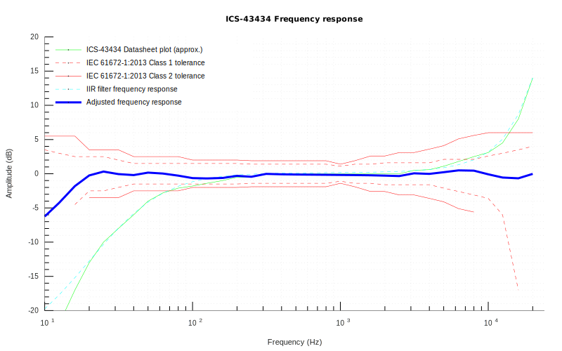

# Sound Level Meter with Arduino IDE, ESP32 and I2S MEMS microphone

Yet another Arduino/ESP32 sound level meter (SLM). This one is using of inexpensive, factory calibrated, digital I2S MEMS microphone and digital IIR filters (vs. FFT) for equalization and A-weighting.

Theoretically, i.e. with ICS-4343x, this should get you +/-1dB(A) measurement within 20Hz-20KHz range.

You can find a bit more information in my [hackday.io](https://hackaday.io/project/166867-esp32-i2s-slm) project.
